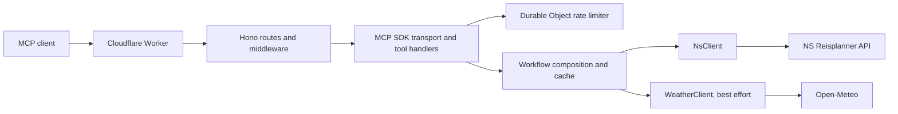

# Architecture and Extension Guide

This document describes how the Nederlandse Treinreisplanner MCP Worker is put together and where to make changes when adding functionality. It is intended for developers and coding agents. The repository's [README](README.md) describes user-facing tools and setup; [docs/mcp-server.md](docs/mcp-server.md) has detailed MCP behavior and examples.

## System Overview

The application is a stateless HTTP service on Cloudflare Workers. MCP clients send JSON-RPC requests to `/mcp`; the Worker validates and dispatches tools, calls NS and (for optional enrichment) Open-Meteo, normalizes provider payloads, and returns an MCP response. `/health` is a separate liveness endpoint. There is no application database or browser frontend.



## Source Map

| File | Responsibility |
| --- | --- |
| [src/index.ts](src/index.ts) | Cloudflare entry point; creates the Hono app and exports the Durable Object class. |
| [src/server.ts](src/server.ts) | Hono app, CORS and request logging middleware, `/health`, `/mcp`, and 404 handling. |
| [src/mcp.ts](src/mcp.ts) | MCP request handling, tool schemas and registration, workflow composition, caching, rate-limit selection, safe tool logging, and text formatting. This is the main feature-composition module. |
| [src/nsClient.ts](src/nsClient.ts) | NS HTTP requests and conversion of NS payloads into application domain types. |
| [src/weatherClient.ts](src/weatherClient.ts) | Open-Meteo request and weather response normalization. |
| [src/rateLimiter.ts](src/rateLimiter.ts) | Durable Object implementation of a per-client fixed-window rate limit. |
| [src/config.ts](src/config.ts) | Runtime configuration defaults and parsing. |
| [src/logging.ts](src/logging.ts) | Request-level metadata logging middleware. |
| [src/types.ts](src/types.ts) | Worker bindings and shared domain/input/result types. |
| [test/app.test.ts](test/app.test.ts) | HTTP/MCP behavior tests, tool-surface assertions, and mocked upstream API scenarios. |
| [wrangler.toml](wrangler.toml) | Worker settings, non-secret variables, and Durable Object binding/migration. |

## Request Lifecycle

1. Cloudflare invokes `src/index.ts`, which exports the Hono app from `createApp()` and registers `McpRateLimiter` as a Durable Object class.
2. `src/server.ts` applies CORS and request logging middleware. `GET /health` returns a small status response. Requests to `/mcp` are passed to `handleMcpRequest`; unknown routes return JSON 404.
3. `handleMcpRequest` inspects a clone of the incoming JSON-RPC request. Only `tools/call` requests are rate-limited; initialization, ping, and `tools/list` are not. The client key comes from `CF-Connecting-IP`, then `X-Forwarded-For`, then a shared `unknown-client` fallback.
4. With the production binding present, the per-client count is kept by a named Durable Object. Without the binding (as in some local/test setups), an in-memory map is used. Both use a one-minute fixed window. Rejected calls return HTTP 429 and a `Retry-After` header.
5. The official MCP SDK's `WebStandardStreamableHTTPServerTransport` handles the request. A server and transport are created for each HTTP request; the server does not rely on an MCP session surviving between requests.
6. `createMcpServer` registers the default public workflow tools. The API-near tools are registered only when the optional `exposeApiNearTools` argument is true; the deployed entry point uses the default `false`. The public tool list is asserted in `test/app.test.ts`.
7. A tool handler validates inputs with Zod, calls `observeToolCall`, performs domain work, then returns `structuredContent` and text `content`. Provider errors are allowed to surface through the MCP SDK rather than being converted into fabricated results.

## Domain and Data Flow

### Workflow tools and API-near tools

The public tools are workflow-oriented: they accept natural station names (including misspellings), compose multiple provider operations, and return results suitable for one user request. Examples include resolving stations before planning, comparing journey options, and combining a planned journey with warnings or journey details.

The API-near tools in `src/mcp.ts` represent smaller provider operations such as station search, departures, journey details, prices, and disruptions. Their registrations are behind `exposeApiNearTools`; they are not part of the default external tool surface. Shared workflow logic calls the same clients and cached operations directly rather than depending on a separate HTTP API layer.

### Provider clients and domain types

`NsClient` owns NS URLs, query parameters, the subscription-key header, HTTP status handling, and normalization from inconsistent NS payload shapes. It throws `NsApiError` for non-success responses. Add provider endpoint mechanics there, not in an MCP handler. The MCP layer should work with the normalized types in `src/types.ts`.

`WeatherClient` converts Open-Meteo's current/hourly payload into `WeatherResult`. Weather is enrichment, not a prerequisite for a train result: missing coordinates or a weather-provider error produces `weather: null` and the train response can still succeed.

### Station resolution and composition

Workflow entry points use `resolveStation` and `requireResolvedStation` to resolve user input to an NS station result and fail clearly when no match exists. Journey planning then maps the resolved station codes and user options into `JourneyPlanInput` before calling `NsClient.planJourney`. Other workflows compose the same primitives: for example, pricing can plan first to get route/time inputs, and planned journey details can fetch a single trip and a bounded set of leg details.

Keep derived values traceable to provider results. Recommendation ranking may compare returned duration, transfers, status, cancellations, and warnings, but must not invent live travel facts. MCP tools are read-only and annotate that contract in their metadata.

## Caching and State

Caches are module-level `Map` instances in `src/mcp.ts`. On Workers they are best-effort, isolate-local memory: they are not durable, globally shared, or guaranteed to survive another request. The Durable Object stores rate-limit state, not application data.

Current cache lifetimes:

| Data | Lifetime |
| --- | ---: |
| Station search and station information | 24 hours |
| Nearest stations | 10 minutes |
| Weather success / failure | 10 minutes / 1 minute |
| Departures, arrivals, single-trip results, journey details | 30 seconds |
| Prices | 1 hour |
| General, station, and single disruptions | 1 minute |
| New journey plans | Not cached |

Cache keys include the query inputs that affect results. Coordinates are rounded before nearest-station and weather lookups. When adding a cache, account for freshness, language, and every result-affecting parameter; use the existing `getFromCache`/`setCache` helpers where appropriate.

The table describes each cache's own TTL. An aggregate result can retain nested data longer: for example, station information (including its weather object) is cached for 24 hours even though standalone weather entries expire after 10 minutes.

## Adding Functionality

### Add or change an upstream NS operation

1. Add or update the input/result types in `src/types.ts`.
2. Add the HTTP method and response normalization in `src/nsClient.ts`. Keep the API key in the existing subscription-key header path; never put it in a URL or response.
3. Add a cached wrapper in `src/mcp.ts` when the operation's freshness profile warrants it. Decide TTL based on how quickly that data changes.
4. Add an API-near registration if the primitive should be independently reusable, then compose it into a workflow if it supports a user task. Remember that API-near registrations are not exposed by default.
5. Add tests using the existing mocked-fetch helpers in `test/app.test.ts`; cover normal payloads and relevant missing/irregular NS fields.

### Add a public workflow tool

1. Define its input schema with Zod and its output schema alongside the other MCP schemas in `src/mcp.ts`. Bound strings, numbers, arrays, and optional inputs; give defaults only when they have a clear domain meaning.
2. Register it in `createMcpServer` outside the `exposeApiNearTools` block. Give it a stable name, useful title/description, output schema, and the shared read-only/open-world annotations.
3. Implement orchestration in a focused helper near the other workflow helpers. Reuse station resolution, cached provider operations, and normalized domain types rather than re-parsing provider payloads in the handler.
4. Wrap provider/domain work with `observeToolCall`. Return a minimal `structuredContent` matching the declared output schema and useful text `content`. Workflow presentation instructions are also reflected in server instructions and tool descriptions; preserve those conventions when the client needs a stable textual rendering.
5. Add the tool name and metadata expectations to the `tools/list` test. Add mocked end-to-end tool-call tests for output, edge cases, and upstream failures. Update [README.md](README.md) and [docs/mcp-server.md](docs/mcp-server.md) when the externally visible tool catalog or behavior changes.

## Configuration, Security, and Observability

The Worker binding contract is `Env` in `src/types.ts`; defaults are centralized in `src/config.ts`, while deployment defaults and the Durable Object binding live in `wrangler.toml`. `NS_API_KEY` is a secret and should be configured with Wrangler's secret mechanism, not committed to source control. Optional runtime settings include NS/weather base URLs, response mode, log level, and the per-minute tool-call limit.

`PLUGIN_BEARER_TOKEN`, `WORKERS_ACCOUNT`, and `WORKER_URL` appear in the example environment file but are not read by the Worker source. Treat them as external tooling/deployment settings, not as Worker runtime bindings, unless that integration is deliberately implemented.

The `/mcp` endpoint currently has no authentication and is public; rate limiting is not authentication. Keep logs privacy-conscious: `observeToolCall` redacts keys resembling tokens, secrets, API keys, `ctxRecon`, and journey detail references, and truncates nested values. Do not log raw request bodies, credentials, raw NS responses, or full travel data when extending observability. Weather failures are deliberately caught and cached briefly so an optional provider cannot break core train functionality.

## Development and Verification

Use Node.js 22 or newer. Typical checks are:

```powershell
npm run typecheck
npm test
npm run validate
```

The test suite runs with Vitest (`vitest.config.ts`). Tests exercise the Hono app directly with an `Env` object and mocked NS responses; new tool behavior should follow that pattern. For local Worker behavior, use `npm run dev` and test the MCP endpoint at `http://localhost:8787/mcp`. Deployment and MCP Inspector instructions are in the [README](README.md) and [deployment guide](docs/deployment.md).