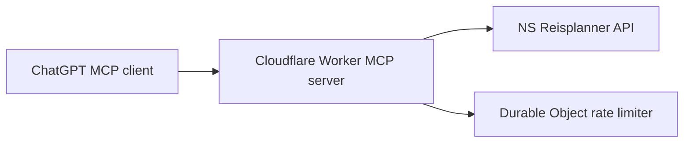

# Nederlandse Treinreisplanner MCP Worker

Cloudflare Worker MCP-server die actuele Nederlandse treinreisinformatie ophaalt via de NS Reisplanner API. De server gebruikt de officiële MCP TypeScript SDK met streamable HTTP transport.

## Architectuur



## Endpoints

- `GET /health`: publieke healthcheck.
- `/mcp`: publieke MCP streamable HTTP endpoint voor `GET`, `POST`, `DELETE` en `OPTIONS`.

## MCP-tools

### API-nabije tools (niet extern exposed)

| Tool | Doel |
| --- | --- |
| `search_stations` | Zoek stations en stationcodes met optionele landfiltering en fuzzy typo fallback. |
| `get_station_info` | Haal stationsdetails op voor een stationcode. |
| `get_nearest_stations` | Zoek stations bij expliciet opgegeven coordinaten. |
| `get_station_departures` | Haal het actuele vertrekbord voor een station op. |
| `get_station_arrivals` | Haal het actuele aankomstbord voor een station op. |
| `plan_journey` | Plan een actuele treinreis. |
| `get_single_trip` | Reconstrueer een volledige trip met `ctxRecon`. |
| `get_journey_details` | Haal ritdetails op met `journeyDetailRef` of treinnummer. |
| `get_domestic_price` | Haal binnenlandse prijsinformatie op. |
| `get_disruptions` | Haal algemene verstoringen, calamiteiten en werkzaamheden op. |
| `get_station_disruptions` | Haal station-specifieke verstoringen op. |
| `get_single_disruption` | Haal details van een verstoring op. |

Deze API-nabije tools blijven in de code beschikbaar voor interne compositie en hergebruik, maar worden niet geregistreerd in de publieke MCP-toolset. Externe MCP-clients zien uitsluitend de workflowtools hieronder.

### Workflowtools

| Tool | Doel |
| --- | --- |
| `plan_resolved_journey` | Plan een reis met stationsnamen, stationcodes of typfouten. |
| `recommend_journey` | Vergelijk actuele reisopties en geef een aanbeveling op basis van snelheid, overstappen of betrouwbaarheid. |
| `get_resolved_station_departures` | Haal vertrekbord op met stationsnaam, stationcode of typfout. |
| `get_resolved_station_arrivals` | Haal aankomstbord op met stationsnaam, stationcode of typfout. |
| `get_resolved_station_disruptions` | Haal stationverstoringen op met stationsnaam, stationcode of typfout. |
| `price_resolved_journey` | Plan en prijs een reis met stationsnamen of typfouten. |
| `get_planned_journey_details` | Plan een reis en haal details van de beste optie op. |
| `check_route_disruptions` | Controleer routewaarschuwingen en stationverstoringen. |
| `check_journey_status` | Controleer reisstatus en waarschuwingen. |
| `find_departure_platform` | Vind vertrekspoor vanaf station richting bestemming. |
| `check_planned_journey_warnings` | Verzamel waarschuwingen voor een geplande reis. |
| `resolve_station` | Vind de beste stationmatch voor naam, afkorting, code of typfout. |
| `find_nearest_station` | Vind het dichtstbijzijnde station bij expliciete coordinaten. |
| `get_train_stops` | Toon tussenstops met `journeyDetailRef`, treinnummer of route. |

Alle tools zijn read-only, gebruiken minimale `structuredContent` en publiceren ChatGPT-relevante metadata zoals `title`, `inputSchema`, `outputSchema` en annotations. `search_stations` retourneert per resultaat een `matchType` zoals `exact`, `contains`, `fuzzy` of `fallback`. Gebruik voor chatvragen bij voorkeur de workflowtools; die resolveeren stationsnamen en typfouten in dezelfde MCP-call.

Workflowtools geven daarnaast een vaste tekstuele presentatie terug in `content`. De client wordt gevraagd deze tekst als primaire weergave te gebruiken, inclusief de vaste volgorde van vertrek, aankomst, duur, overstappen, treinlegs, sporen en tussenstops. In deze presentatie worden buslegs weggelaten; de MCP-server kan de exacte visuele kaartweergave van de client niet afdwingen.

### Voorbeeldvragen

| Vraag | MCP-tool |
| --- | --- |
| Welke trein kan ik nu nemen van Amsterdam Centraal naar Utrecht Centraal? | `plan_resolved_journey` |
| Plan een reis van Rotterdam Centraal naar Schiphol Airport morgenochtend om 08:30. | `plan_resolved_journey` |
| Hoe kom ik van Eindhoven Centraal naar Amsterdam Centraal vandaag na 17:00? | `plan_resolved_journey` |
| Wat is de snelste treinreis van Utrecht Centraal naar Groningen? | `plan_resolved_journey` |
| Welke treinen vertrekken nu vanaf Amsterdam Centraal? | `get_resolved_station_departures` |
| Welke treinen komen de komende tijd aan op Utrecht Centraal? | `get_resolved_station_arrivals` |
| Zijn er storingen rond Amsterdam Centraal? | `get_resolved_station_disruptions` |
| Zijn er werkzaamheden of verstoringen tussen Rotterdam en Den Haag? | `check_route_disruptions` |
| Is mijn trein van Utrecht naar Eindhoven vertraagd? | `check_journey_status` |
| Vanaf welk spoor vertrekt mijn trein naar Schiphol? | `find_departure_platform` |
| Hoe laat kom ik aan als ik nu vertrek van Leiden Centraal naar Den Haag Centraal? | `plan_resolved_journey` |
| Wat kost een enkele reis van Amsterdam Centraal naar Utrecht Centraal? | `price_resolved_journey` |
| Wat kost deze reis in de eerste klas? | `price_resolved_journey` |
| Zoek het station "Amsterdm" en gebruik de beste match. | `resolve_station` |
| Wat is het dichtstbijzijnde station bij mijn locatie? | `find_nearest_station` |
| Geef details van deze reisoptie, inclusief overstappen en perrons. | `get_planned_journey_details` |
| Toon de tussenstops van mijn trein. | `get_train_stops` |
| Zijn er meldingen of waarschuwingen voor mijn geplande reis? | `check_planned_journey_warnings` |
| Plan een toegankelijke reis van Amsterdam Centraal naar Eindhoven Centraal. | `plan_resolved_journey` |
| Plan een reis van Groningen naar Maastricht met zo min mogelijk overstappen. | `plan_resolved_journey` |
| Welke reis raad je aan van Amsterdam Centraal naar Eindhoven als ik vooral snel wil aankomen? | `recommend_journey` |
| Welke reis heeft de minste overstappen van Rotterdam naar Groningen? | `recommend_journey` |
| Geef een betrouwbare reisoptie van Utrecht naar Schiphol met actuele waarschuwingen. | `recommend_journey` |

## Lokale setup

1. Installeer Node.js 22 of nieuwer.
2. Installeer dependencies:

   ```powershell
   npm install
   ```

   Als `npm` niet globaal beschikbaar is, gebruik dan de meegeleverde wrapper:

   ```powershell
   .\scripts\npm.ps1 install
   ```

3. Zet de NS API-key als Cloudflare secret:

   ```powershell
   wrangler secret put NS_API_KEY
   ```

   Zonder globale Wrangler-installatie:

   ```powershell
   .\scripts\wrangler.ps1 secret put NS_API_KEY
   ```

4. Start lokaal:

   ```powershell
   npm run dev
   ```

## Configuratie

| Variabele | Doel |
| --- | --- |
| `NS_API_KEY` | Subscription key voor de NS API. |
| `NS_API_BASE_URL` | Basis-URL van de NS Reisplanner API. |
| `RESPONSE_MODE` | `strict` of `flexible`; beïnvloedt de tekstuele reisplansamenvatting. |
| `LOG_LEVEL` | Gebruik `info` voor productie en `debug` voor requestmetadata tijdens debugging. |
| `MCP_RATE_LIMIT_PER_MINUTE` | Maximum aantal publieke MCP tool-calls per client per minuut via de Durable Object limiter. Default: `45`. |

## Testen en validatie

```powershell
npm run typecheck
npm test
npm run validate
```

Zonder globale Node/npm-installatie:

```powershell
.\scripts\npm.ps1 run validate
```

MCP Inspector starten:

```powershell
npm run mcp:inspect
```

## Remote MCP

Voor ChatGPT Developer Mode of andere remote MCP-clients gebruik je:

```text
https://nederlandse-treinreisplanner.nederlandsetreinreisplanner.workers.dev/mcp
```

Authenticatie: geen.

Zie [docs/mcp-server.md](docs/mcp-server.md) voor voorbeeldcalls, productiegedrag en ChatGPT-reviewstappen.

## Deployment

```powershell
npm run deploy
```

Zonder globale Node/npm-installatie:

```powershell
.\scripts\npm.ps1 run deploy
```

Controleer na deployment:

- `https://<worker-url>/health`
- MCP `tools/list` op `https://<worker-url>/mcp`
- een MCP `tools/call` naar `plan_resolved_journey` of `get_resolved_station_departures`
